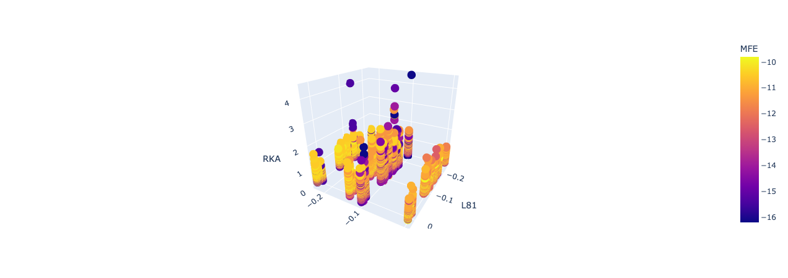
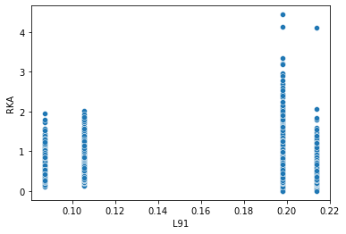
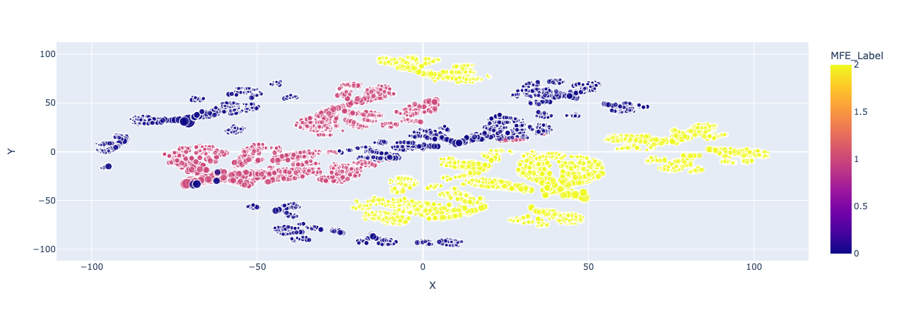
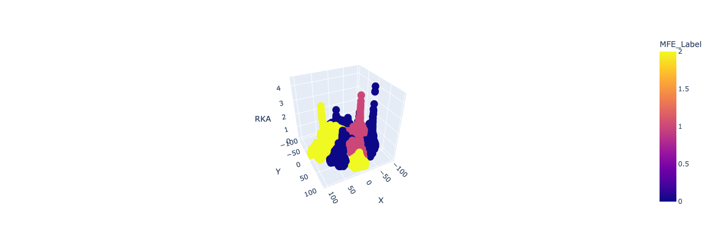
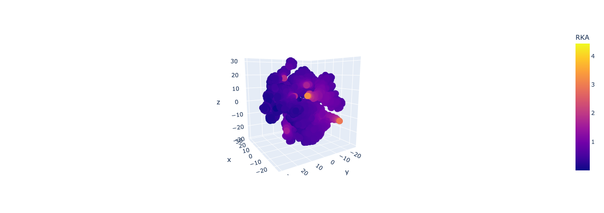

# Apply Embedding on Realizing High Throughput Binding Assay Dataset with RNA Structure
## Import packages


```python
import pandas as pd
import tensorflow as tf
import numpy as np
import seaborn as sns
from sklearn.model_selection import train_test_split
from sklearn.preprocessing import MinMaxScaler, Normalizer, KBinsDiscretizer
from sklearn.pipeline import Pipeline, make_pipeline
```

## Data Preparation
### Import data


```python
df = pd.read_csv("Result_Structure.csv")
df.head()
```


<div>
<style scoped>
    .dataframe tbody tr th:only-of-type {
        vertical-align: middle;
    }

    .dataframe tbody tr th {
        vertical-align: top;
    }

    .dataframe thead th {
        text-align: right;
    }
</style>
<table border="1" class="dataframe">
  <thead>
    <tr style="text-align: right;">
      <th></th>
      <th>Sequence</th>
      <th>Structure</th>
      <th>MFE</th>
      <th>K</th>
      <th>KA</th>
      <th>RKA</th>
      <th>Qc</th>
      <th>sevenMer</th>
    </tr>
  </thead>
  <tbody>
    <tr>
      <th>0</th>
      <td>GGAUCCAUUCAAAAAAAGAACGGAUCC</td>
      <td>((((((.(((.......))).))))))</td>
      <td>-10.5</td>
      <td>4.971544</td>
      <td>0.201145</td>
      <td>0.395847</td>
      <td>0</td>
      <td>AAAAAAA</td>
    </tr>
    <tr>
      <th>1</th>
      <td>GGAUCCAUUCAAAAAACGAACGGAUCC</td>
      <td>((((((.(((.......))).))))))</td>
      <td>-10.5</td>
      <td>4.514383</td>
      <td>0.221514</td>
      <td>0.435934</td>
      <td>0</td>
      <td>AAAAAAC</td>
    </tr>
    <tr>
      <th>2</th>
      <td>GGAUCCAUUCAAAAAAGGAACGGAUCC</td>
      <td>((((((.(((.......))).))))))</td>
      <td>-10.4</td>
      <td>3.609146</td>
      <td>0.277074</td>
      <td>0.545273</td>
      <td>0</td>
      <td>AAAAAAG</td>
    </tr>
    <tr>
      <th>3</th>
      <td>GGAUCCAUUCAAAAAAUGAACGGAUCC</td>
      <td>((((((.((((.....)))).))))))</td>
      <td>-11.7</td>
      <td>6.607685</td>
      <td>0.151339</td>
      <td>0.297831</td>
      <td>0</td>
      <td>AAAAAAU</td>
    </tr>
    <tr>
      <th>4</th>
      <td>GGAUCCAUUCAAAAACAGAACGGAUCC</td>
      <td>((((((.(((.......))).))))))</td>
      <td>-10.5</td>
      <td>3.221327</td>
      <td>0.310431</td>
      <td>0.610919</td>
      <td>0</td>
      <td>AAAAACA</td>
    </tr>
  </tbody>
</table>
</div>


### Set a function to cut the sequence to two nucleotide window.


```python
def cutWord(x, window=2):
    seq2word = []
    for i in range(13):
        seq2word.append(x[i*window:i*window+window])
    return " ".join(seq2word)
```

### Slice data for training and test set


```python
target = df[['MFE','RKA']].copy()
sequences = df[["Sequence"]].copy()
#seq_spaced = sequences.applymap(" ".join)
seq_spaced = sequences.applymap(cutWord)

#Divide to train and test
X_train, X_test, y_train, y_test = train_test_split(seq_spaced, target, test_size=0.33, random_state=42)

#Use KBinsDiscretizer to cut continuous y data to categorical numbers.
KBD = KBinsDiscretizer(n_bins=3, encode='ordinal').fit(y_train)
y_train = KBD.transform(y_train)
y_test = KBD.transform(y_test)

#mm = make_pipeline(MinMaxScaler(), KBD())
#y_train = mm.fit_transform(y_train)
#y_test = mm.transform(y_test)

#Use seaborn to check the data
#sns.histplot(y_train)
#sns.scatterplot(x = y_train[:,0], y = y_train[:,1])
```

### Convert pandas dataframe to tensorflow dataset


```python
#Training data
data_train = tf.data.Dataset.from_tensor_slices((X_train, y_train))
data_test = tf.data.Dataset.from_tensor_slices((X_test, y_test))
#data_tf.shuffle(60)
```

    2022-01-09 17:34:16.733561: I tensorflow/core/platform/cpu_feature_guard.cc:151] This TensorFlow binary is optimized with oneAPI Deep Neural Network Library (oneDNN) to use the following CPU instructions in performance-critical operations:  AVX2 FMA
    To enable them in other operations, rebuild TensorFlow with the appropriate compiler flags.


## Model Preparation
### Sequence Vectorization


```python
#Text vectorize
sequence_database = tf.data.Dataset.from_tensor_slices(X_train)
vectorize_layer = tf.keras.layers.TextVectorization(max_tokens=16, output_mode='int', output_sequence_length=13, name ='vectorize_layer')
vectorize_layer.adapt(seq_spaced)
```

### Embedding layer


```python
embedding_layer = tf.keras.layers.Embedding(input_dim=16, output_dim=2, name = 'embedding_layer')

```

### Create Model


```python

def model_gen():
    input = tf.keras.Input(shape=(1,), dtype='string')
    x = vectorize_layer(input)
    x = embedding_layer(x)
    x = tf.keras.layers.GlobalAveragePooling1D()(x)
    x = tf.keras.layers.Dense(16, activation='relu')(x)
    output = tf.keras.layers.Dense(2)(x)

    model = tf.keras.Model(inputs=input, outputs=output)
    return(model)
```


```python
model=model_gen()
model.compile(optimizer='adam',
              loss=tf.keras.losses.BinaryCrossentropy(),
              metrics=['accuracy'])

#Set up tensorboard callback function
tensorboard_callback = tf.keras.callbacks.TensorBoard('./logs', update_freq=1)
```

### Training


```python
model.fit(
    data_train,
    validation_data=data_test,
    epochs=3,
    callbacks=[tensorboard_callback]
    )

```

    Epoch 1/3
    10977/10977 [==============================] - 10s 890us/step - loss: -0.7932 - accuracy: 0.3259 - val_loss: -0.7262 - val_accuracy: 0.3311
    Epoch 2/3
    10977/10977 [==============================] - 10s 930us/step - loss: -0.7932 - accuracy: 0.3259 - val_loss: -0.7262 - val_accuracy: 0.3311
    Epoch 3/3
    10977/10977 [==============================] - 10s 928us/step - loss: -0.7932 - accuracy: 0.3259 - val_loss: -0.7262 - val_accuracy: 0.3311


    <keras.callbacks.History at 0x7f976bc828b0>


### Extract layers from model


```python
model.summary()
layer1 = model.get_layer('vectorize_layer')
layer2 = model.get_layer('embedding_layer')
```

    Model: "model"
    _________________________________________________________________
     Layer (type)                Output Shape              Param #   
    =================================================================
     input_1 (InputLayer)        [(None, 1)]               0         
                                                                     
     vectorize_layer (TextVector  (None, 13)               0         
     ization)                                                        
                                                                     
     embedding_layer (Embedding)  (None, 13, 2)            32        
                                                                     
     global_average_pooling1d (G  (None, 2)                0         
     lobalAveragePooling1D)                                          
                                                                     
     dense (Dense)               (None, 16)                48        
                                                                     
     dense_1 (Dense)             (None, 2)                 34        
                                                                     
    =================================================================
    Total params: 114
    Trainable params: 114
    Non-trainable params: 0
    _________________________________________________________________


### Convert every RNA sequence into a 2D space


```python
#Embedding
final_result = layer1(seq_spaced)
final_result = layer2(final_result)
final_result = final_result.numpy()

#Convert tensorflow result to pandas DataFrame
df_cp = df.copy()
for i in range(13):
    for j in range(2):
        df_cp["L"+str(i+1)+str(j+1)] = final_result[:,i,j]

df_cp.head()
```


<div>
<style scoped>
    .dataframe tbody tr th:only-of-type {
        vertical-align: middle;
    }

    .dataframe tbody tr th {
        vertical-align: top;
    }

    .dataframe thead th {
        text-align: right;
    }
</style>
<table border="1" class="dataframe">
  <thead>
    <tr style="text-align: right;">
      <th></th>
      <th>Sequence</th>
      <th>Structure</th>
      <th>MFE</th>
      <th>K</th>
      <th>KA</th>
      <th>RKA</th>
      <th>Qc</th>
      <th>sevenMer</th>
      <th>L11</th>
      <th>L12</th>
      <th>...</th>
      <th>L91</th>
      <th>L92</th>
      <th>L101</th>
      <th>L102</th>
      <th>L111</th>
      <th>L112</th>
      <th>L121</th>
      <th>L122</th>
      <th>L131</th>
      <th>L132</th>
    </tr>
  </thead>
  <tbody>
    <tr>
      <th>0</th>
      <td>GGAUCCAUUCAAAAAAAGAACGGAUCC</td>
      <td>((((((.(((.......))).))))))</td>
      <td>-10.5</td>
      <td>4.971544</td>
      <td>0.201145</td>
      <td>0.395847</td>
      <td>0</td>
      <td>AAAAAAA</td>
      <td>0.198112</td>
      <td>0.148604</td>
      <td>...</td>
      <td>0.105646</td>
      <td>0.063200</td>
      <td>0.192291</td>
      <td>0.141136</td>
      <td>0.2139</td>
      <td>0.17939</td>
      <td>0.175661</td>
      <td>0.089248</td>
      <td>0.15786</td>
      <td>0.127779</td>
    </tr>
    <tr>
      <th>1</th>
      <td>GGAUCCAUUCAAAAAACGAACGGAUCC</td>
      <td>((((((.(((.......))).))))))</td>
      <td>-10.5</td>
      <td>4.514383</td>
      <td>0.221514</td>
      <td>0.435934</td>
      <td>0</td>
      <td>AAAAAAC</td>
      <td>0.198112</td>
      <td>0.148604</td>
      <td>...</td>
      <td>0.213900</td>
      <td>0.179390</td>
      <td>0.192291</td>
      <td>0.141136</td>
      <td>0.2139</td>
      <td>0.17939</td>
      <td>0.175661</td>
      <td>0.089248</td>
      <td>0.15786</td>
      <td>0.127779</td>
    </tr>
    <tr>
      <th>2</th>
      <td>GGAUCCAUUCAAAAAAGGAACGGAUCC</td>
      <td>((((((.(((.......))).))))))</td>
      <td>-10.4</td>
      <td>3.609146</td>
      <td>0.277074</td>
      <td>0.545273</td>
      <td>0</td>
      <td>AAAAAAG</td>
      <td>0.198112</td>
      <td>0.148604</td>
      <td>...</td>
      <td>0.198112</td>
      <td>0.148604</td>
      <td>0.192291</td>
      <td>0.141136</td>
      <td>0.2139</td>
      <td>0.17939</td>
      <td>0.175661</td>
      <td>0.089248</td>
      <td>0.15786</td>
      <td>0.127779</td>
    </tr>
    <tr>
      <th>3</th>
      <td>GGAUCCAUUCAAAAAAUGAACGGAUCC</td>
      <td>((((((.((((.....)))).))))))</td>
      <td>-11.7</td>
      <td>6.607685</td>
      <td>0.151339</td>
      <td>0.297831</td>
      <td>0</td>
      <td>AAAAAAU</td>
      <td>0.198112</td>
      <td>0.148604</td>
      <td>...</td>
      <td>0.087136</td>
      <td>0.063333</td>
      <td>0.192291</td>
      <td>0.141136</td>
      <td>0.2139</td>
      <td>0.17939</td>
      <td>0.175661</td>
      <td>0.089248</td>
      <td>0.15786</td>
      <td>0.127779</td>
    </tr>
    <tr>
      <th>4</th>
      <td>GGAUCCAUUCAAAAACAGAACGGAUCC</td>
      <td>((((((.(((.......))).))))))</td>
      <td>-10.5</td>
      <td>3.221327</td>
      <td>0.310431</td>
      <td>0.610919</td>
      <td>0</td>
      <td>AAAAACA</td>
      <td>0.198112</td>
      <td>0.148604</td>
      <td>...</td>
      <td>0.105646</td>
      <td>0.063200</td>
      <td>0.192291</td>
      <td>0.141136</td>
      <td>0.2139</td>
      <td>0.17939</td>
      <td>0.175661</td>
      <td>0.089248</td>
      <td>0.15786</td>
      <td>0.127779</td>
    </tr>
  </tbody>
</table>
<p>5 rows × 34 columns</p>
</div>


## Data Visualozation by plotly
### 3D plot with 8th and 9th two nucleotides with relative binding ability (Relative association constant) 


```python
import plotly.express as px
df = df_cp
fig = px.scatter_3d(df, x='L81', y='L91', z='RKA', color='MFE',
                   custom_data=['sevenMer', 'RKA', 'MFE'])
#set hover
fig.update_traces(
    hovertemplate = "<br>".join([
    "Seq: %{customdata[0]}",
    "RKA: %{customdata[1]}",
    "MFE: %{customdata[2]}"])
)

fig.show()
```



### Use seaborn to show the 9th two nucleotide and binding ability


```python
sns.scatterplot(data=df_cp, x='L91', y='RKA')
```


    <AxesSubplot:xlabel='L91', ylabel='RKA'>


    

    


## Apply t-SNE to visualize the groups

### Implement t-SNE by sklearn
Here to set t-SNE, the parameter, perplexity, is very critical and is recommended in range of 5 to 50. It can affect the grouping result.


```python
from sklearn.manifold import TSNE

#data for t-SNE
df_tsne = df_cp.copy()
df_tsne = df_tsne.drop(["Sequence", "Structure", "K", "KA", "Qc", "sevenMer"], axis = 1)
X_embedded = TSNE(n_components=2, learning_rate='auto', init='random', perplexity=50).fit_transform(df_tsne)
```

### Convert t-SNE result to padnas DataFrame in order to perform data visualization


```python
labels = KBD.transform(target)
df_tsne["X"] = X_embedded[:,0]
df_tsne["Y"] = X_embedded[:,1]
df_tsne["sequence"] = df.sevenMer

df_tsne["MFE_Label"] = labels[:,0]
df_tsne["RKA_Label"] = labels[:,1]
df_tsne.head()
```


<div>
<style scoped>
    .dataframe tbody tr th:only-of-type {
        vertical-align: middle;
    }

    .dataframe tbody tr th {
        vertical-align: top;
    }

    .dataframe thead th {
        text-align: right;
    }
</style>
<table border="1" class="dataframe">
  <thead>
    <tr style="text-align: right;">
      <th></th>
      <th>MFE</th>
      <th>RKA</th>
      <th>L11</th>
      <th>L12</th>
      <th>L21</th>
      <th>L22</th>
      <th>L31</th>
      <th>L32</th>
      <th>L41</th>
      <th>L42</th>
      <th>...</th>
      <th>L112</th>
      <th>L121</th>
      <th>L122</th>
      <th>L131</th>
      <th>L132</th>
      <th>X</th>
      <th>Y</th>
      <th>sequence</th>
      <th>MFE_Label</th>
      <th>RKA_Label</th>
    </tr>
  </thead>
  <tbody>
    <tr>
      <th>0</th>
      <td>-10.5</td>
      <td>0.395847</td>
      <td>0.198112</td>
      <td>0.148604</td>
      <td>0.244296</td>
      <td>0.187945</td>
      <td>0.197445</td>
      <td>0.159261</td>
      <td>0.244296</td>
      <td>0.187945</td>
      <td>...</td>
      <td>0.17939</td>
      <td>0.175661</td>
      <td>0.089248</td>
      <td>0.15786</td>
      <td>0.127779</td>
      <td>-13.216305</td>
      <td>82.612900</td>
      <td>AAAAAAA</td>
      <td>2.0</td>
      <td>0.0</td>
    </tr>
    <tr>
      <th>1</th>
      <td>-10.5</td>
      <td>0.435934</td>
      <td>0.198112</td>
      <td>0.148604</td>
      <td>0.244296</td>
      <td>0.187945</td>
      <td>0.197445</td>
      <td>0.159261</td>
      <td>0.244296</td>
      <td>0.187945</td>
      <td>...</td>
      <td>0.17939</td>
      <td>0.175661</td>
      <td>0.089248</td>
      <td>0.15786</td>
      <td>0.127779</td>
      <td>-5.667831</td>
      <td>57.684933</td>
      <td>AAAAAAC</td>
      <td>2.0</td>
      <td>1.0</td>
    </tr>
    <tr>
      <th>2</th>
      <td>-10.4</td>
      <td>0.545273</td>
      <td>0.198112</td>
      <td>0.148604</td>
      <td>0.244296</td>
      <td>0.187945</td>
      <td>0.197445</td>
      <td>0.159261</td>
      <td>0.244296</td>
      <td>0.187945</td>
      <td>...</td>
      <td>0.17939</td>
      <td>0.175661</td>
      <td>0.089248</td>
      <td>0.15786</td>
      <td>0.127779</td>
      <td>-9.838823</td>
      <td>44.773403</td>
      <td>AAAAAAG</td>
      <td>2.0</td>
      <td>1.0</td>
    </tr>
    <tr>
      <th>3</th>
      <td>-11.7</td>
      <td>0.297831</td>
      <td>0.198112</td>
      <td>0.148604</td>
      <td>0.244296</td>
      <td>0.187945</td>
      <td>0.197445</td>
      <td>0.159261</td>
      <td>0.244296</td>
      <td>0.187945</td>
      <td>...</td>
      <td>0.17939</td>
      <td>0.175661</td>
      <td>0.089248</td>
      <td>0.15786</td>
      <td>0.127779</td>
      <td>-19.781631</td>
      <td>5.901041</td>
      <td>AAAAAAU</td>
      <td>0.0</td>
      <td>0.0</td>
    </tr>
    <tr>
      <th>4</th>
      <td>-10.5</td>
      <td>0.610919</td>
      <td>0.198112</td>
      <td>0.148604</td>
      <td>0.244296</td>
      <td>0.187945</td>
      <td>0.197445</td>
      <td>0.159261</td>
      <td>0.244296</td>
      <td>0.187945</td>
      <td>...</td>
      <td>0.17939</td>
      <td>0.175661</td>
      <td>0.089248</td>
      <td>0.15786</td>
      <td>0.127779</td>
      <td>-8.072945</td>
      <td>92.212944</td>
      <td>AAAAACA</td>
      <td>2.0</td>
      <td>2.0</td>
    </tr>
  </tbody>
</table>
<p>5 rows × 33 columns</p>
</div>


### 2D data visualization


```python
import plotly.express as px
df = df_cp
fig = px.scatter(df_tsne, x='X', y='Y', color = "MFE_Label", size = 'RKA', size_max=20,
                    custom_data=['RKA', 'sequence'])
                    
#set hover
fig.update_traces(
    hovertemplate = "<br>".join([
    "Seq: %{customdata[1]}",
    "RKA: %{customdata[0]}"])
)
fig.show()
```



### 2D t-SNE result with association affinity in z axis


```python
import plotly.express as px
df = df_cp
fig = px.scatter_3d(df_tsne, x='X', y='Y', z = "RKA", color = 'MFE_Label',
                 custom_data=['RKA', 'sequence'])
#set hover
fig.update_traces(
    hovertemplate = "<br>".join([
    "Seq: %{customdata[0]}",
    "RKA: %{customdata[1]}",
    "MFE: %{customdata[2]}"])
)
```



### 3D t-SNE Demo


```python
df_key = df_cp[["MFE","RKA","L71", "L81", "L91"]] 
X_embedded = TSNE(n_components=3, learning_rate='auto', init='random', perplexity=50).fit_transform(df_key)
df_visual = pd.DataFrame(X_embedded)
df_visual.head()
```


<div>
<style scoped>
    .dataframe tbody tr th:only-of-type {
        vertical-align: middle;
    }

    .dataframe tbody tr th {
        vertical-align: top;
    }

    .dataframe thead th {
        text-align: right;
    }
</style>
<table border="1" class="dataframe">
  <thead>
    <tr style="text-align: right;">
      <th></th>
      <th>0</th>
      <th>1</th>
      <th>2</th>
    </tr>
  </thead>
  <tbody>
    <tr>
      <th>0</th>
      <td>-0.849502</td>
      <td>-3.664813</td>
      <td>-0.403546</td>
    </tr>
    <tr>
      <th>1</th>
      <td>20.275452</td>
      <td>-7.190567</td>
      <td>-4.473881</td>
    </tr>
    <tr>
      <th>2</th>
      <td>-6.880295</td>
      <td>1.162096</td>
      <td>-23.713425</td>
    </tr>
    <tr>
      <th>3</th>
      <td>-2.313077</td>
      <td>18.493587</td>
      <td>-8.623339</td>
    </tr>
    <tr>
      <th>4</th>
      <td>4.395565</td>
      <td>2.660769</td>
      <td>-0.734723</td>
    </tr>
  </tbody>
</table>
</div>


### Preparation for data visualization


```python
df_visual["RKA"] = df_key.RKA
df_visual["sequence"] = df.sevenMer
df_visual.columns = ["x", "y", "z", "RKA","sequence"]
df_visual.head()
```


<div>
<style scoped>
    .dataframe tbody tr th:only-of-type {
        vertical-align: middle;
    }

    .dataframe tbody tr th {
        vertical-align: top;
    }

    .dataframe thead th {
        text-align: right;
    }
</style>
<table border="1" class="dataframe">
  <thead>
    <tr style="text-align: right;">
      <th></th>
      <th>x</th>
      <th>y</th>
      <th>z</th>
      <th>RKA</th>
      <th>sequence</th>
    </tr>
  </thead>
  <tbody>
    <tr>
      <th>0</th>
      <td>-0.849502</td>
      <td>-3.664813</td>
      <td>-0.403546</td>
      <td>0.395847</td>
      <td>AAAAAAA</td>
    </tr>
    <tr>
      <th>1</th>
      <td>20.275452</td>
      <td>-7.190567</td>
      <td>-4.473881</td>
      <td>0.435934</td>
      <td>AAAAAAC</td>
    </tr>
    <tr>
      <th>2</th>
      <td>-6.880295</td>
      <td>1.162096</td>
      <td>-23.713425</td>
      <td>0.545273</td>
      <td>AAAAAAG</td>
    </tr>
    <tr>
      <th>3</th>
      <td>-2.313077</td>
      <td>18.493587</td>
      <td>-8.623339</td>
      <td>0.297831</td>
      <td>AAAAAAU</td>
    </tr>
    <tr>
      <th>4</th>
      <td>4.395565</td>
      <td>2.660769</td>
      <td>-0.734723</td>
      <td>0.610919</td>
      <td>AAAAACA</td>
    </tr>
  </tbody>
</table>
</div>


### Visualize data by 3D scatter plot in plotly


```python
import plotly.express as px
df = df_cp
fig = px.scatter_3d(df_visual, x='x', y='y', z='z', color = "RKA", size_max=15,
                    custom_data=['RKA', 'sequence'])
                    
#set hover
fig.update_traces(
    hovertemplate = "<br>".join([
    "Seq: %{customdata[1]}",
    "RKA: %{customdata[0]}"])
)
fig.show()
```




